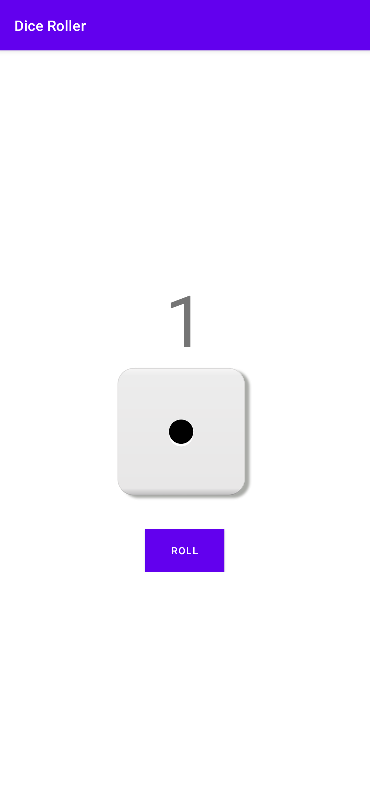
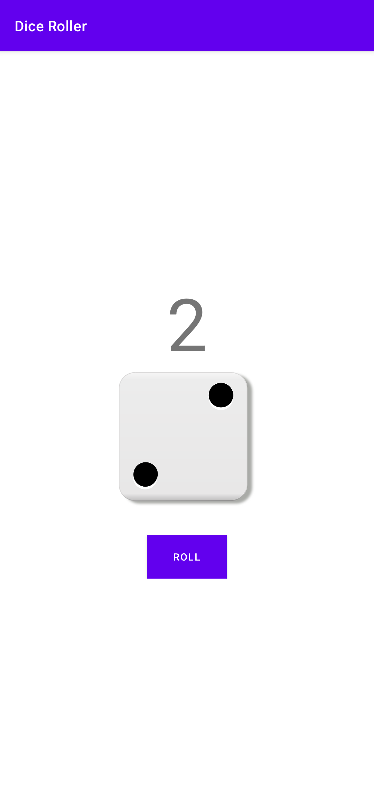
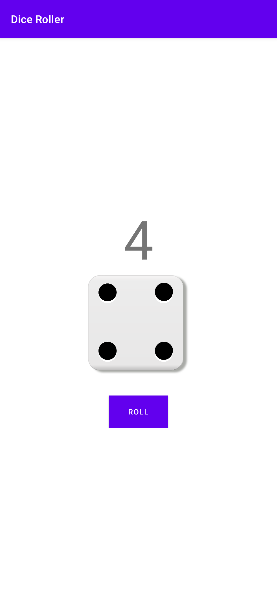
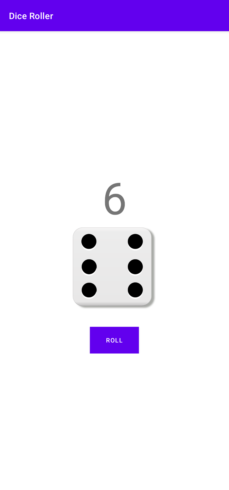

<h1 align="center">Dice Roller (Android App)</h1>

## Built With
- [Android Studio](https://developer.android.com/studio)
- [Kotlin](https://developer.android.com/kotlin) (Though didn't write a single line of kotlin code here)

## Features
- Count 1 to 6 Randomly
- Visual Cubic Image with Digit Display

## Preview

 
   
   
   
   

